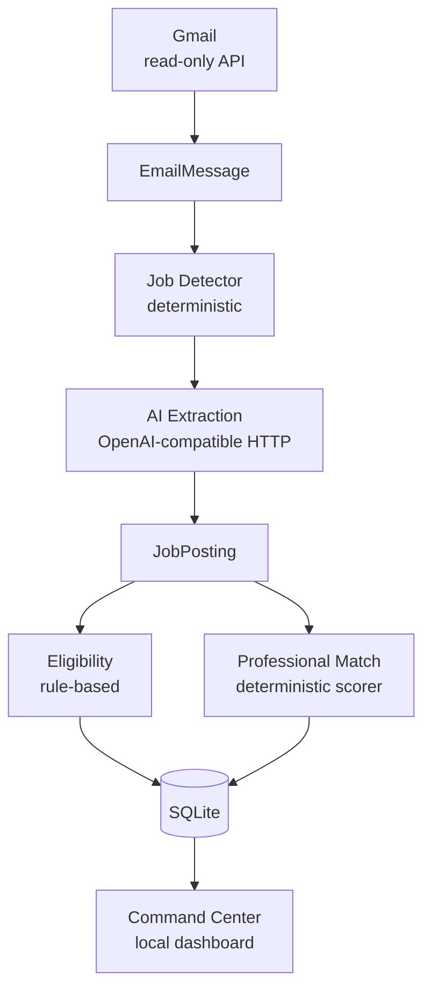
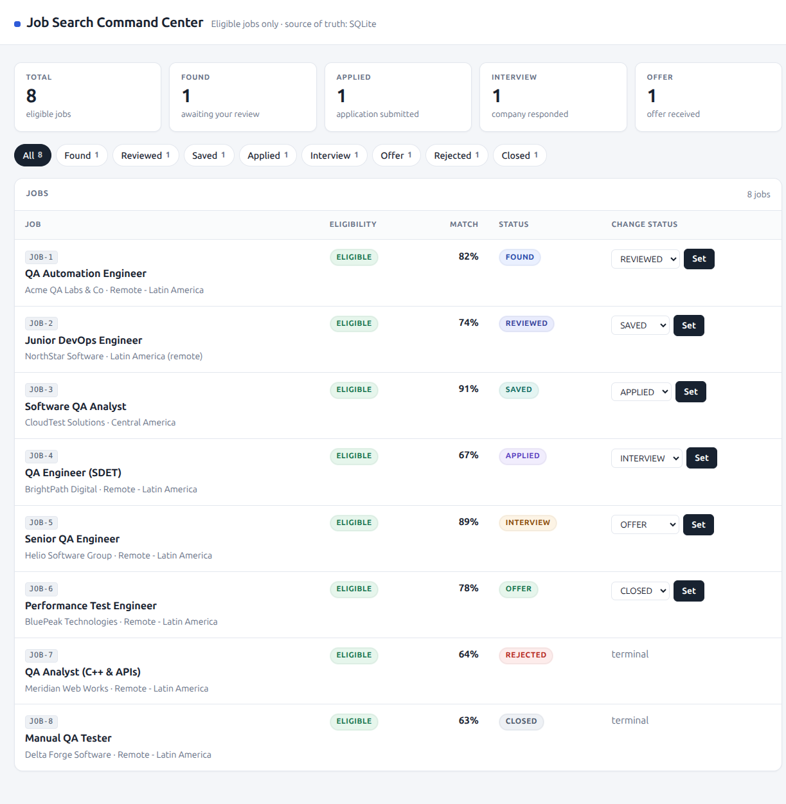
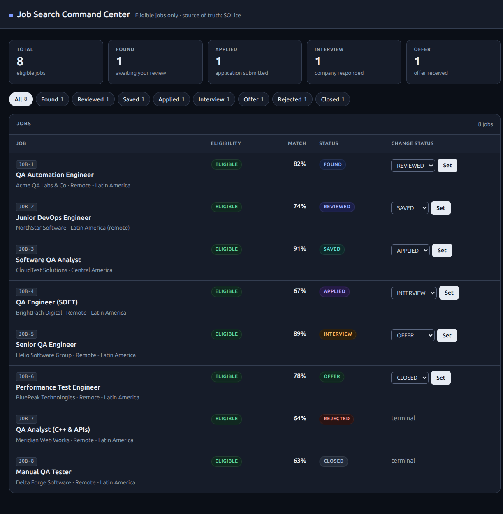
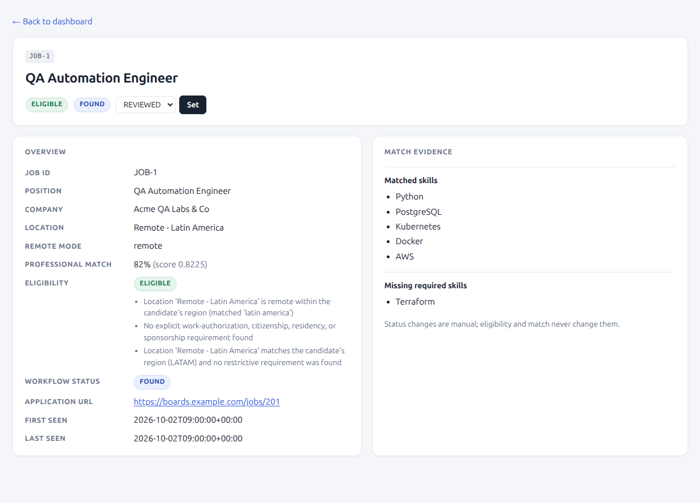
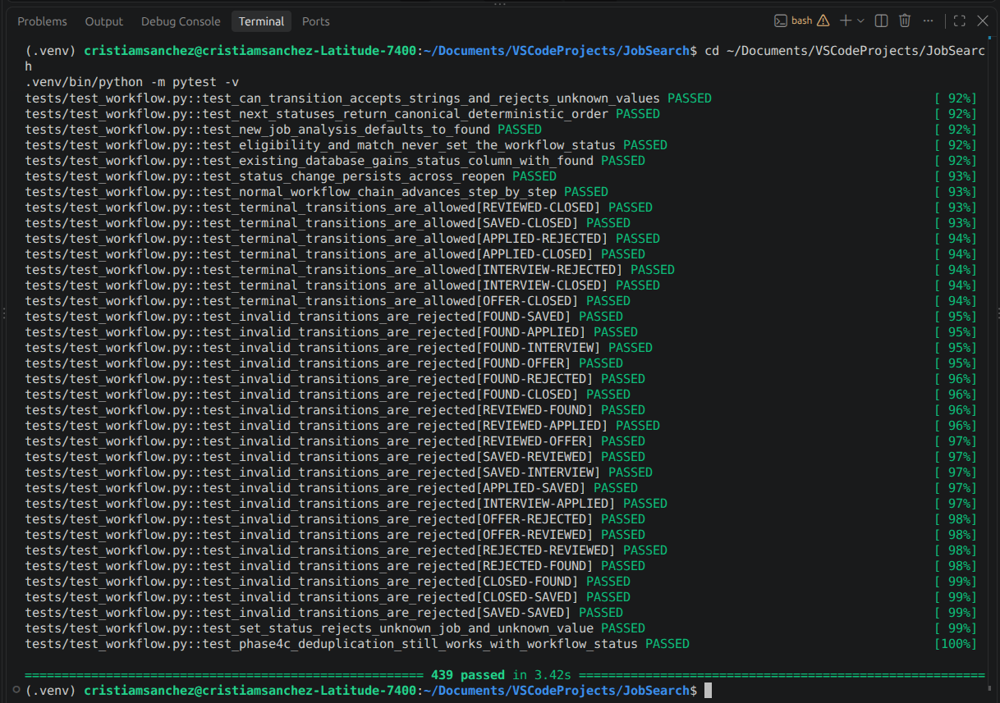

# JobSearch

**A local-first, AI-assisted job discovery and analysis platform.**

JobSearch turns a noisy inbox into a structured, queryable job pipeline. It
reads job-related emails from Gmail with a **read-only** OAuth scope,
detects which messages actually look like jobs, extracts structured job
information through an OpenAI-compatible AI endpoint, evaluates every
posting against a career profile, and stores the results in a local SQLite
database with a **Command Center** dashboard on top.

Everything runs on your machine: no cloud deployment, no scheduler, no
external job-board APIs, no telemetry, no accounts.

- Reads job-related emails from Gmail using **read-only OAuth**
- Detects likely job emails **deterministically**, before any AI call
- Extracts structured job information with an **OpenAI-compatible AI endpoint**
- Evaluates **eligibility** with explicit, rule-based logic
- Calculates **professional match** (0.0–1.0) with a deterministic scorer
- Persists results in **SQLite** with deduplication and idempotency
- Provides a local **Command Center dashboard** — responsive, with automatic dark mode

---

## Why this project exists

The technical problem behind job hunting is not "finding postings" — it is
**unstructured, duplicated, decision-poor data**:

1. **Job information arrives as free text.** Emails and postings are prose.
   Anything useful (skills, seniority, salary, location, work-authorization
   requirements) has to be turned into a validated, structured record —
   without letting a probabilistic model invent facts that were never
   stated.
2. **Extraction and decisions must not be mixed.** An LLM is good at
   parsing text and unreliable at consistent judgment. The system therefore
   draws a hard line: AI **extracts**; deterministic code **decides**.
   Eligibility and match score are computed exclusively by rule-based
   engines that behave identically on every run.
3. **The same job shows up many times.** Alerts, digests and recruiters all
   reference one opportunity with different senders, subjects and tracking
   URLs. Deduplication has to be deterministic and conservative: prove two
   records are the same job, or keep them apart.
4. **Job-search state is application state.** "Found → reviewed → saved →
   applied → interviewed → offer" is a small state machine with real rules
   (no skipping backwards, no reopening terminal states), and it must be
   persisted, not kept in a browser tab.
5. **Personal data is sensitive.** Career facts, mailbox contents and API
   keys belong on the user's machine. The whole pipeline is local-first:
   SQLite on disk, ignored secrets, a dashboard bound to loopback.

JobSearch is the minimal, tested implementation of that pipeline.

---

## Features

| Feature | What it does |
|---------|--------------|
| **Gmail read-only ingestion** | OAuth with the `gmail.readonly` scope; only `users.messages.list` and `users.messages.get` are ever called — never send, modify, delete, archive, or mark as read |
| **Deterministic job email detection** | A score-based detector classifies each message as `JOB_LIKELY` (≥ 4), `POSSIBLE_JOB` (1–3) or `NOT_JOB` (0) from subject/body content only — no AI, no sender/domain rules |
| **AI extraction** | Turns raw posting text into a validated `JobPosting` over a provider-neutral, OpenAI-compatible HTTP interface; invalid output fails safely instead of being coerced |
| **Eligibility classification** | Rule-based `ELIGIBLE` / `NOT_ELIGIBLE` / `REVIEW_REQUIRED` / `UNKNOWN`, evaluated from location and work-authorization evidence |
| **Professional match** | A fully deterministic 0.0–1.0 score with matched/missing skills, gaps and interview topics — never calculated by AI |
| **SQLite persistence** | Emails, jobs, their relationships and their full analyses, written in one transaction with foreign keys enforced |
| **Deduplication / idempotency** | `message_id` uniqueness plus canonical-URL and normalized-attribute dedup: re-running a sync never duplicates emails or jobs and never repeats AI calls |
| **Workflow / status management** | Manual `FOUND → REVIEWED → SAVED → APPLIED → INTERVIEW → OFFER` (+ terminal `REJECTED` / `CLOSED`), validated on every write and persisted |
| **Responsive dashboard** | A dependency-free `http.server` UI: summary cards, status filters, job detail pages; narrow screens collapse the table into stacked cards |
| **Automatic dark mode** | `@media (prefers-color-scheme: dark)` — follows the OS/browser preference with no toggle, no script, no dependency |
| **Offline test suite** | 439 pytest tests with mocked Gmail/OAuth/AI and in-memory or temporary databases — no key, credential or network access required |

---

## Architecture

A staged pipeline: each stage has one job, and the deterministic engines sit
between the probabilistic extraction and the storage.



```text
Gmail → EmailMessage → Job Detector → AI Extraction → JobPosting
      → Eligibility + Professional Match → SQLite → Command Center
```

Boundaries that the test suite enforces:

- **AI only extracts.** No code path lets the model compute an eligibility
  status or a match score; invalid extraction stops before the engines run.
- **Persistence only stores.** The SQLite layer never scores, classifies, or
  decides anything.
- **The dashboard only presents.** It reads the database and writes back
  manual workflow status — it never re-detects, re-extracts or re-scores.
- **No source-specific logic.** LinkedIn, Jobright, alerts, recruiters or
  unknown senders all flow through the same email boundary; a test scans
  the ingestion modules for job-board references.

---

## Tech Stack

| Layer | Technology |
|-------|------------|
| Language | Python 3.12+ (`>=3.12`) |
| Dashboard | Python standard library `http.server` + inline HTML/CSS (no framework, no JavaScript) |
| Database | SQLite through the standard library `sqlite3` (no ORM, no server) |
| AI transport | Standard-library `urllib` POST to any OpenAI-compatible chat-completions endpoint (no provider SDK) |
| Gmail | `google-api-python-client` + `google-auth-oauthlib`, imported lazily and only by the real sync |
| Email parsing / config / models | Standard library (`email`, `json`, `dataclasses`, `enum`, `pathlib`) |
| Tests | `pytest` |

Deliberately **not** used: web frameworks, CSS/JS frameworks, build steps,
ORMs, containers, cloud services, message queues, or AI SDKs.

---

## Project Structure

```text
JobSearch/
├── src/
│   └── jobsearch/
│       ├── config.py             # Environment-based configuration (.env)
│       ├── models.py             # CandidateProfile, JobPosting, results
│       ├── ingestion.py          # Manual JSON ingestion (jobs + profile)
│       ├── eligibility.py        # Rule-based eligibility engine
│       ├── professional_match.py # Deterministic match scorer
│       ├── extraction.py         # Provider-neutral extraction schema + validation
│       ├── analysis.py           # analyze_job() / analyze_description()
│       ├── email_provider.py     # EmailProvider protocol
│       ├── gmail.py              # Read-only Gmail adapter (OAuth)
│       ├── job_email_detector.py # Deterministic job-email detector
│       ├── email_pipeline.py     # Email → extraction → analysis
│       ├── persistence.py        # SQLite persistence + deduplication
│       ├── workflow.py           # Manual workflow statuses + transitions
│       ├── command_center.py     # Eligible-jobs read model
│       ├── dashboard.py          # Local Command Center (http.server UI)
│       ├── ai_extractor.py       # AI extraction over stdlib HTTP
│       ├── gmail_sync.py         # Manual Gmail sync command
│       ├── gmail_check.py        # Read-only OAuth/Gmail connectivity check
│       └── ai_check.py           # Isolated AI-extractor check
├── data/
│   ├── career_profile.example.json  # Committed, sanitized example profile
│   ├── career_profile.json          # Your real profile — LOCAL ONLY, git-ignored
│   ├── jobs.json                    # Manual JSON job ingestion
│   └── jobsearch.db                 # SQLite runtime database — git-ignored
├── secrets/                        # Gmail OAuth credentials/token — git-ignored
├── tests/                          # 439 offline tests (pytest)
├── docs/screenshots/               # Dashboard screenshots (see Dashboard section)
├── .env.example                    # Configuration template, placeholders only
├── .env                            # Your local configuration — git-ignored
├── LOCAL_SETUP.md                  # Complete step-by-step local guide
├── pyproject.toml                  # Metadata + pytest configuration
├── requirements.txt                # Optional Gmail client libraries
├── requirements-dev.txt            # pytest
└── README.md
```

---

## Gmail Integration

Gmail is the ingestion boundary: raw emails in, structured records out.

- **OAuth, local and read-only.** Credentials are a *Desktop app* OAuth
  client JSON placed outside Git (default `secrets/gmail_credentials.json`).
  The first command that needs Gmail opens the **local browser** consent
  screen (`InstalledAppFlow.run_local_server`) and caches the token at
  `secrets/gmail_token.json`; every later run **reuses and refreshes** that
  token without a browser.
- **One scope only:** `https://www.googleapis.com/auth/gmail.readonly`.
- **Two calls only:**
  - `users.messages.list` — search with the configured `GMAIL_QUERY`
  - `users.messages.get` — retrieve a message by id
- **Never** sends, modifies, deletes, archives, moves, relabels, or marks
  messages as read. A test asserts the adapter source contains none of
  those operations.
- **Configuration, not code:** `GMAIL_QUERY` (any Gmail search syntax),
  `GMAIL_MAX_RESULTS`, `GMAIL_CREDENTIALS_FILE`, `GMAIL_TOKEN_FILE`.
- **Credentials stay local.** `.env` and the whole `secrets/` directory are
  git-ignored; no credential, token or key is ever printed, logged or
  committed, and error messages name configuration *variables*, never
  values.

Validation utilities:

```bash
PYTHONPATH=src .venv/bin/python -m jobsearch.gmail_check   # OAuth + read-only connectivity
PYTHONPATH=src .venv/bin/python -m jobsearch.gmail_sync    # one manual sync pass
```

Exit codes for both: `0` success · `2` configuration/OAuth problem · `1`
operational failure. Details in [LOCAL_SETUP.md](LOCAL_SETUP.md).

---

## AI Integration

- **Provider-agnostic, OpenAI-compatible HTTP.** The extractor POSTs a
  chat-completions request with the standard library (`urllib`) — no SDK,
  no vendor lock-in, no new dependency.
- **Configuration:**
  - `AI_BASE_URL` — base URL of any OpenAI-compatible endpoint
  - `AI_MODEL` — model to use (must come from the same provider as the URL)
  - `AI_API_KEY` — key, set only in the local `.env` (never committed,
    never passed on the command line, excluded from `repr()` output)
  - `AI_TIMEOUT_SECONDS` — per-request timeout (1–600, default `60`)
- **Gemini** can be used through its OpenAI-compatible endpoint by
  configuration alone — no code change and no provider SDK:

  ```dotenv
  AI_BASE_URL=https://generativelanguage.googleapis.com/v1beta/openai
  AI_MODEL=gemini-3.8-flash
  ```

- **Validation over trust.** The model must return a JSON object; required
  fields (`position`, `company`, `location`) must be non-empty; `remote_mode`,
  experience, salary and URLs are type-checked. Failures raise a single
  deterministic `ExtractionValidationError` listing every problem — bad
  output is never coerced into a posting.
- **No hallucinated facts.** Salary, location and work authorization are
  never inferred; unspecified optional fields stay empty, and any
  work-authorization sentence missing from an AI-supplied description fails
  validation so evidence cannot be silently dropped.
- **The AI never calculates results.** Only `evaluate_eligibility()` sets a
  status and only `evaluate_professional_match()` sets a score.

Validate an AI configuration in isolation (nothing is persisted and the key
is never printed):

```bash
PYTHONPATH=src .venv/bin/python -m jobsearch.ai_check
```

---

## Eligibility Engine

Implemented in `src/jobsearch/eligibility.py` as
`evaluate_eligibility(posting, profile)` — **rule-based and deterministic**,
never AI-assisted. It reads the posting's structured `location` and the
complete description, looking for location rules and explicit
work-authorization, citizenship, visa and residency requirements.

| Status | Meaning |
|--------|---------|
| `ELIGIBLE` | The posting fits the profile's rules (e.g. remote in the configured region) |
| `NOT_ELIGIBLE` | An explicit, unambiguous exclusion applies (e.g. on-site, hybrid, US-only) |
| `REVIEW_REQUIRED` | Plausibly applicable, but something needs a human decision (e.g. worldwide remote) |
| `UNKNOWN` | The posting does not state enough information to decide |

Design rules:

- **Ambiguity never becomes a decision.** When evidence is unclear the
  result is `REVIEW_REQUIRED` or `UNKNOWN`, not an unsupported verdict.
  `NOT_ELIGIBLE` is reserved for explicit exclusions.
- **Eligibility is independent from professional match.** `EligibilityResult`
  has no score field at all; `ProfessionalMatch` has no status field. The two
  are computed side by side and never merged, averaged or compared — a job
  can be `NOT_ELIGIBLE` with a 0.95 match, or `ELIGIBLE` with a 0.14 match.
- **Only `ELIGIBLE` jobs reach the dashboard.** The others stay fully
  persisted in SQLite and are filtered from the view — never deleted.

---

## Professional Match

Implemented in `src/jobsearch/professional_match.py` as
`evaluate_professional_match(posting, profile)` → `ProfessionalMatch`.
**Fully deterministic and standard-library only: no AI or LLM is involved
in the score.**

It produces a score between **0.0 and 1.0** plus the evidence behind it:
`matched_skills`, `partial_matches`, `missing_required_skills`,
`missing_preferred_skills`, `experience_matches`, `cv_keywords`,
`interview_topics` and a per-dimension `rationale`.

| Dimension | Weight | Posting | Profile |
|-----------|-------:|---------|---------|
| Required skills | 0.35 | `required_skills` | `skills` + `technologies` |
| Preferred skills | 0.10 | `preferred_skills` | `skills` + `technologies` |
| Experience | 0.20 | `min_experience_years` | `years_experience` |
| Technologies / tools | 0.15 | `technologies` | `technologies` + `skills` |
| Education | 0.08 | `education` | `education` |
| Certifications | 0.05 | `certifications` | `certifications` |
| Languages | 0.07 | `languages` | `languages` |
| **Total** | **1.00** | | |

```text
score = Σ (weight × subscore) / Σ weight   over the dimensions the posting states
```

- **Stated by the posting, absent from the profile** → subscore `0.0`
  (missing data never earns credit).
- **Not stated by the posting** → dimension excluded and the remaining
  weights renormalized.
- **No professional requirements at all** → `0.0`, with the rationale
  "no professional requirements stated".
- Item matching is exact `1.0` / partial `0.5` / missing `0.0`, after
  case-folding, separator normalization and a small deterministic alias
  table (`K8s` → kubernetes, `Postgres` → postgresql, …).

The committed example profile reproduces the reference example: a posting
asking for Python/FastAPI/PostgreSQL with 5 years of experience scores
**0.95** (only the preferred "Terraform" missing) while that same posting is
`NOT_ELIGIBLE` for a US-only location — two engines, two independent answers.

```python
from jobsearch.analysis import analyze_job

analysis = analyze_job(posting, profile)
analysis.professional_match.score   # 0.95 — computed by evaluate_professional_match()
analysis.eligibility.status         # NOT_ELIGIBLE — computed by evaluate_eligibility()
```

---

## Data & Persistence

Implemented in `src/jobsearch/persistence.py` (standard-library `sqlite3`,
database at `DATABASE_PATH`, default `data/jobsearch.db`, git-ignored).

| Table | Holds |
|-------|-------|
| `emails` | every inbound email, body verbatim, keyed by a unique `message_id`, with its outcome and any extraction error |
| `jobs` | the normalized posting (JSON-encoded fields), `canonical_url`, first/last seen timestamps and the workflow `status` |
| `email_jobs` | how one email references one job (relationship + how it was matched) |
| `job_analyses` | the **complete** match and eligibility results as JSON — never just a score/status |

- **One transaction per result:** email, job, link and analysis are written
  atomically — no partially persisted job, nothing silently swallowed.
- **Email idempotency:** `message_id` is UNIQUE, so processing the same
  message twice still yields one row, one job, one analysis.
- **Job deduplication, deterministic and conservative:**
  1. canonical application URL (tracking parameters stripped, everything
     else kept) → same job;
  2. otherwise, all four normalized attributes (company, title, location,
     remote mode) → same job;
  3. matching subject + sender on an earlier email only adds a *possible
     duplicate* link — **both records are kept**, nothing is auto-merged.
- **Timestamps:** `first_seen_at` is written once, `last_seen_at` advances
  only when a new email references the job (timezone-aware UTC).
- **Source-agnostic:** job identity never depends on sender, provider or
  `source_hint`.
- Manual JSON ingestion (`data/jobs.json`) flows through the same models
  when you want to add a posting without Gmail.

---

## Dashboard

The **Command Center**: a local, dependency-free web UI over SQLite at
<http://127.0.0.1:8000>.

```bash
PYTHONPATH=src .venv/bin/python -m jobsearch.dashboard
# → JobSearch AI Command Center → http://127.0.0.1:8000
```

- **Summary cards** — `Total`, `Found`, `Applied`, `Interview`, `Offer`,
  counted over the whole eligible set so a filter never hides them.
- **Filters** — one chip per workflow status plus `All`, each showing its
  live count (`/?status=FOUND`, …); an unknown status returns **400**.
- **Status workflow** — a select + `Set` button offering only the
  transitions currently allowed; every change is validated and written back
  to SQLite, so it survives a refresh. Terminal statuses show `terminal`.
- **Job detail** — `/job/<id>` with position, company, location, match,
  eligibility reasons, workflow status, application URL, first/last seen and
  compact match evidence. Unknown paths return **404**.
- **Responsive layout** — below `760px` the table rows collapse into
  stacked, labelled cards (one inline `@media` rule, no framework, no
  JavaScript).
- **Automatic dark mode** — a pure CSS
  `@media (prefers-color-scheme: dark)` palette: no toggle, no script, no
  dependency, and no behavioral difference between schemes.
- Extracted content (titles, companies, URLs) is HTML-escaped before
  rendering; application URLs render only for `http(s)://` targets.
- The dashboard binds to loopback and has **no authentication** — it is a
  local tool, not a public service.

### Screenshots

Repository-relative paths (added to this folder as the UI is captured):









---

## Local Setup

A fresh clone needs nine steps — the complete, copy-pasteable version with
troubleshooting lives in **[LOCAL_SETUP.md](LOCAL_SETUP.md)**:

1. **Python environment** — `python3.12 -m venv .venv` and activate it
2. **Dependencies** — `pip install -r requirements.txt -r requirements-dev.txt`
3. **Configuration** — `cp .env.example .env` and fill in your local values
4. **Career profile** — `cp data/career_profile.example.json data/career_profile.json`
   (the real `data/career_profile.json` is **intentionally ignored by Git**;
   only the sanitized example is committed — never commit your own copy)
5. **Gmail OAuth credentials** — a *Desktop app* client JSON outside Git
   (default `secrets/gmail_credentials.json`)
6. **AI API key** — `AI_API_KEY` in your local `.env` only, plus a
   consistent `AI_BASE_URL` / `AI_MODEL` pair
7. **Gmail authorization** — `PYTHONPATH=src .venv/bin/python -m jobsearch.gmail_check`
   (first run opens the browser consent)
8. **Sync** — `PYTHONPATH=src .venv/bin/python -m jobsearch.gmail_sync`
   (start with `GMAIL_MAX_RESULTS=1`)
9. **Dashboard** — `PYTHONPATH=src .venv/bin/python -m jobsearch.dashboard`
   and open <http://127.0.0.1:8000>

Requirements: Python 3.12+, Git, a Gmail account, Google Cloud OAuth
credentials (Gmail API), and an API key for an OpenAI-compatible endpoint.

> The package is used directly from `src/`, so every manual command carries
> the `PYTHONPATH=src` prefix. Tests do not need it.

---

## Configuration

Settings are read from the environment at runtime; `.env` (git-ignored)
supplies local values, and real environment variables always win.

| Variable | Default | Description |
|----------|---------|-------------|
| `APP_ENV` | `development` | Runtime label: `development` / `staging` / `production` |
| `LOG_LEVEL` | `INFO` | `DEBUG`, `INFO`, `WARNING`, `ERROR`, `CRITICAL` |
| `GMAIL_QUERY` | `newer_than:7d` | Gmail search syntax used by the manual sync |
| `GMAIL_CREDENTIALS_FILE` | `secrets/gmail_credentials.json` | OAuth client JSON path — outside Git |
| `GMAIL_TOKEN_FILE` | `secrets/gmail_token.json` | Cached OAuth token path — outside Git |
| `GMAIL_MAX_RESULTS` | `50` | Maximum messages returned per search |
| `AI_API_KEY` | *(empty)* | AI endpoint key — local `.env` only, never committed, hidden from `repr()` |
| `AI_BASE_URL` | `https://api.openai.com/v1` | Any OpenAI-compatible chat-completions base URL |
| `AI_MODEL` | `gpt-4o-mini` | Extraction model — must match the provider of `AI_BASE_URL` |
| `AI_TIMEOUT_SECONDS` | `60` | Per-request AI timeout (1–600) |
| `CAREER_PROFILE_PATH` | `data/career_profile.json` | Career profile analyzed during the sync (local, git-ignored) |
| `DATABASE_PATH` | `data/jobsearch.db` | SQLite database (git-ignored; tests use in-memory/temporary databases) |
| `DASHBOARD_HOST` | `127.0.0.1` | Dashboard bind address — keep it on loopback |
| `DASHBOARD_PORT` | `8000` | Dashboard port |

`.env.example` documents each variable with placeholders only — no key,
secret or token — and the test suite scans it for credential-like markers.

---

## Testing

```bash
.venv/bin/python -m pytest -v
```

```text
439 passed
```

The suite is fully offline: Gmail, OAuth and the AI endpoint are always
mocked, database tests use in-memory or temporary SQLite files, and no API
key, credential or network access is ever required. It covers the models,
ingestion, eligibility, professional match, extraction validation, email
detection, pipeline orchestration, persistence and deduplication, workflow
transitions, dashboard routes and rendering, the sync orchestration and the
isolated check utilities.

---

## Security / Secrets

| Asset | Where it lives | Protection |
|-------|----------------|------------|
| `.env` (API key, paths) | repository root | **git-ignored** — never committed; secrets are never passed on the command line |
| Gmail OAuth credentials | `secrets/gmail_credentials.json` | **git-ignored** (`secrets/`); contents never printed or logged |
| Gmail OAuth token | `secrets/gmail_token.json` | **git-ignored**; issued for the read-only scope only — delete it to revoke and re-authorize |
| AI API key (`AI_API_KEY`) | local `.env` | **not committed**; excluded from `repr()` output and never echoed in reports |
| SQLite runtime data | `data/jobsearch.db` | **git-ignored** (`data/*.db*`); tests never touch it |
| Career profile | `data/career_profile.json` | **git-ignored** — only the sanitized `data/career_profile.example.json` is committed |

- Gmail credentials, the Gmail token, API keys and `.env` values are
  **never** documented, printed, logged or committed.
- Error messages name configuration *variables* (for example
  `AI_API_KEY is not set`), never their values.
- `.gitignore` covers `.env`, `.env.*` (except `.env.example`), `secrets/`,
  `*.token.json`, `client_secret*.json`, `data/*.db*` and
  `data/career_profile.json`; a test asserts the sensitive markers stay out
  of the repository.

---

## Current Scope / Non-Goals

This version is **local-first on purpose**. The following are **scope
boundaries, not bugs** — they are deliberately out of scope for the current
version:

- **No cloud deployment** — the app runs on your machine; there is no
  server infrastructure, container or hosted database.
- **No automatic scheduling** — no cron, systemd timer, background worker or
  polling loop. The sync runs only when you invoke it.
- **No GitHub Actions** — no CI/CD workflow files; everything, including
  the tests, runs locally.
- **No automatic job applications** — nothing ever applies on your behalf;
  an application URL only marks a destination.
- **No notifications** — no email sending, push or desktop alerts.
- **No public dashboard authentication** — the dashboard is loopback-only
  (`127.0.0.1`), with no login by design.
- **No external job-board APIs** — LinkedIn, Jobright, Indeed, etc. are not
  integrated; email is the ingestion boundary.

Also out of scope: Notion synchronization, scraping, browser automation,
and any provider SDK in the core. Each remains a possible future phase —
none of it exists today, and nothing here pretends otherwise.

---

## Portfolio Notes

What this repository demonstrates technically:

- **API integration** — Gmail's REST API through a provider-neutral
  `EmailProvider` protocol, with an injected service object so every call
  is mockable.
- **OAuth** — a read-only scope, local browser consent, token caching and
  refresh, with credentials permanently outside Git.
- **AI integration** — a provider-neutral extraction boundary over
  standard-library HTTP, strict output validation, and an enforced rule that
  the model never computes a decision.
- **Deterministic business rules** — eligibility classification, weighted
  match scoring, email detection, workflow transitions and deduplication are
  all explicit, reproducible code with fixed outputs.
- **Data modeling** — dataclasses for profile, posting, analysis,
  eligibility and results, with clear separation between categorical and
  score-bearing outcomes.
- **Persistence** — transactional SQLite with foreign keys, unique
  constraints, indexes and in-place migration.
- **Deduplication** — a conservative, three-level deterministic scheme with
  idempotent reprocessing.
- **Testing** — 439 offline tests across every layer, including source-level
  assertions for security boundaries (no forbidden Gmail operations, no
  secrets committed, no job-board references in ingestion code).
- **Responsive UI** — a dependency-free HTML/CSS dashboard with responsive
  layout and automatic dark mode, respecting pinned HTML contracts under
  test.
- **Security-conscious configuration** — secrets via environment only,
  git-ignored sensitive paths, no credentials in logs, errors that name
  variables instead of values.

No exaggerated claims: no cloud, no scale-out, no ML training, no
production SLOs — a focused, well-tested local MVP.
